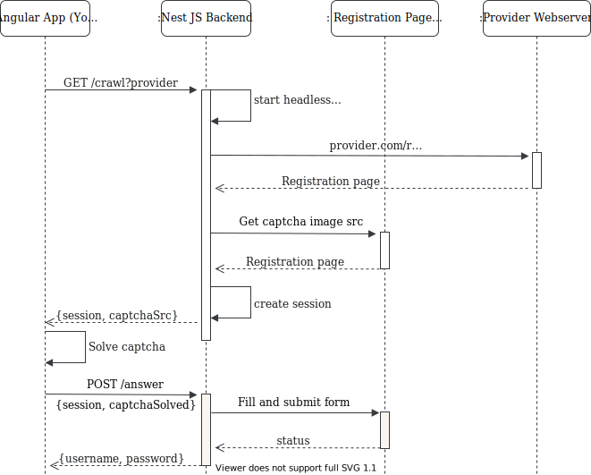

# MailGen

## State

not working yet. webde and gmx protect their forms by checking ip adresses and (probably) overall time it takes to fill out the form. form can be filled with headless chrome but after invoking click on submit button error shows up

## Basic Idea

